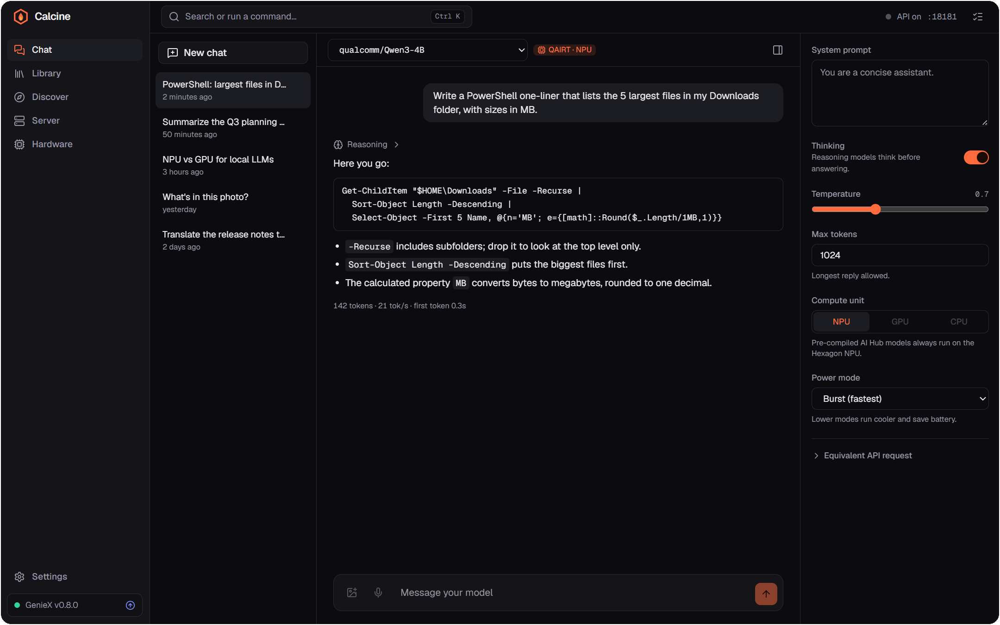
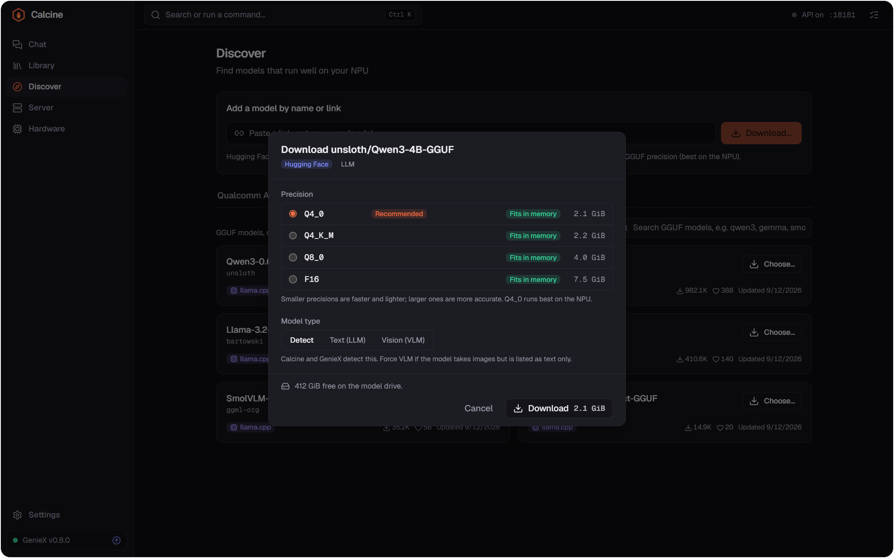
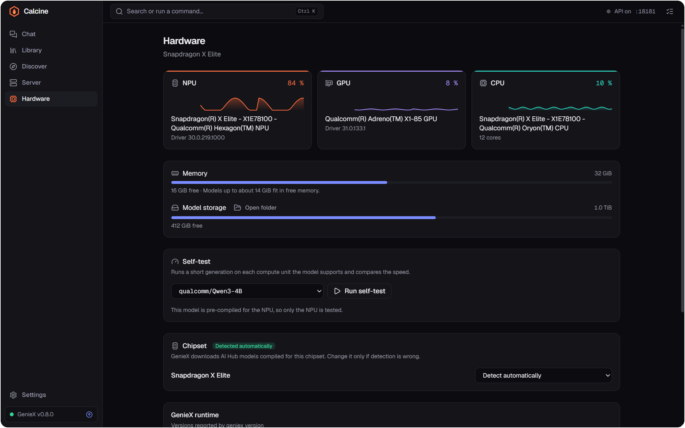
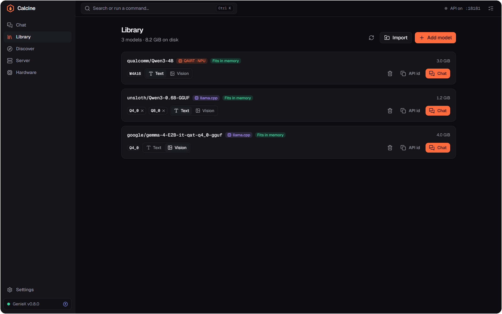
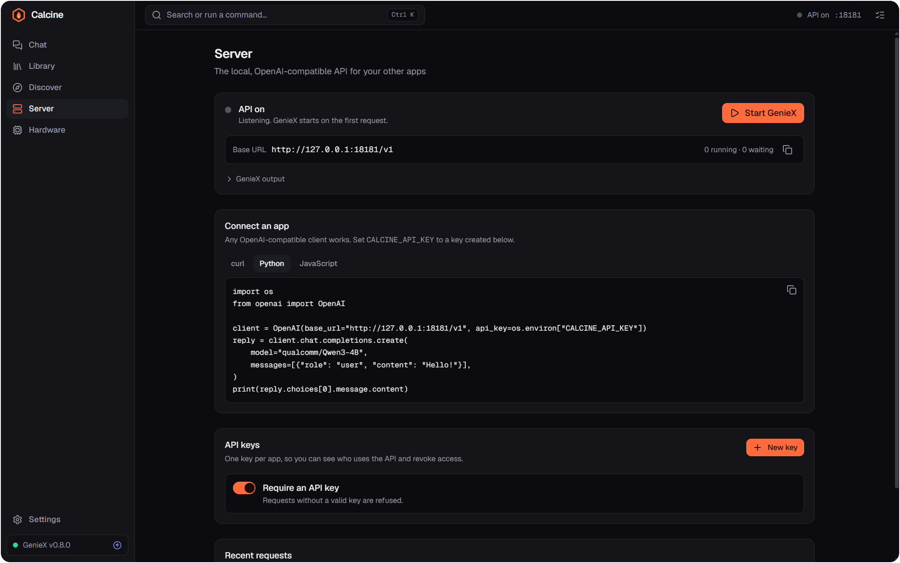
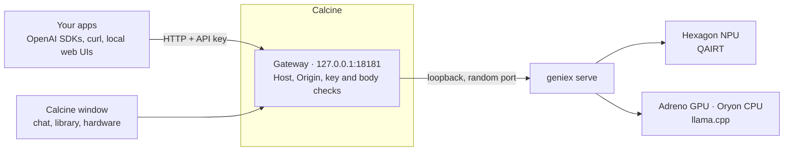

<div align="center">


# Calcine

**Your Snapdragon NPU, as a local AI server.**

A desktop app for [Qualcomm GenieX](https://github.com/qualcomm/GenieX): download language models,
chat with them on the Hexagon NPU, and give every app on your PC a secure, OpenAI-compatible API.

[](https://github.com/eraflo/Calcine/releases)
[](https://github.com/eraflo/Calcine/actions/workflows/ci.yml)
[](LICENSE)


[**Website**](https://eraflo.github.io/Calcine/) ·
[**Download**](https://github.com/eraflo/Calcine/releases) ·
[Security model](docs/security-model.md) ·
[Architecture](docs/architecture.md)

<br />

<picture>
  <source media="(prefers-color-scheme: light)" srcset="site/screenshots/chat-light.png" />
  
</picture>

</div>

## Why Calcine

GenieX runs language models on the Snapdragon NPU, GPU and CPU from the command line,
and `geniex serve` exposes them over HTTP with no authentication and any web origin
allowed. Calcine puts every GenieX command in a friendly window and puts a gateway in
front of the server, so you can hand your models to other apps without handing them to
every web page you visit.

- **Chat with every option.** Thinking, temperature, max tokens, compute unit and power
  mode, adapted to each model's runtime, with tokens per second. Images and voice for
  vision models.
- **Find models that fit.** Qualcomm AI Hub models compiled for your chipset, and GGUF
  models from Hugging Face, with precisions, sizes, memory and disk checks. Paste any
  Hugging Face, ModelScope or Docker Hub link, or import a folder.
- **See the NPU work.** Live NPU, GPU, CPU and memory load, drivers, and a self-test that
  compares speed on each compute unit.
- **Benchmark properly.** Qualcomm's `geniex-bench`, downloaded and verified for you:
  time to first token, prompt and generation speed per unit, with warmup, repetitions,
  history and CSV export.
- **Measure energy.** On Snapdragon X, the chip's own energy metering shows live power, and
  energy per token on each compute unit and power mode, so you can pick the most efficient.
- **Structured output and tools on the NPU.** `response_format` (JSON or a JSON Schema) and
  `tool_choice` work on every model: Calcine asks for JSON or for the call, checks the reply
  against the schema and has the model fix it if needed. Agents can rely on them.
- **Long conversations on the NPU.** AI Hub models have a fixed context window (4096 tokens
  for most). Calcine counts it with the model's own tokenizer, shows how full it is, and lets
  the model forget the oldest messages instead of failing, keeping a summary it writes itself.
  It cuts in steps that keep GenieX's cache useful: the next reply starts in under 0.1 s
  instead of re-reading the whole conversation.
- **Works with Ollama apps.** Ollama's API is translated too, and can answer on Ollama's
  port, 11434, for apps that only speak Ollama.
- **OpenAI-compatible API.** On `127.0.0.1:18181`, GenieX's default port, with per-app keys,
  a request queue and a request log that never records prompts.
- **Share with your other devices.** Optional, over HTTPS with a certificate made on this PC,
  for keys you allow on the network and private networks only.
- **Always up to date.** Calcine installs GenieX on first launch, and can update or roll it
  back. Calcine updates itself with signed packages.
- **English and French**, light and dark themes, a command palette (<kbd>Ctrl</kbd> <kbd>K</kbd>)
  and a tray icon to keep the API running in the background.

<table>
  <tr>
    <td width="50%"></td>
    <td width="50%"></td>
  </tr>
  <tr>
    <td align="center"><b>Discover</b>: the right precision for your memory</td>
    <td align="center"><b>Hardware</b>: live load on every compute unit</td>
  </tr>
  <tr>
    <td width="50%"></td>
    <td width="50%"></td>
  </tr>
  <tr>
    <td align="center"><b>Library</b>: your models, ready to run</td>
    <td align="center"><b>Server</b>: the API, keys and request log</td>
  </tr>
</table>

## Get started

1. Download the installer from [Releases](https://github.com/eraflo/Calcine/releases)
   (Windows 11 on Snapdragon, ARM64).
2. Open Calcine: on first launch it downloads GenieX, Qualcomm's runtime, from Qualcomm
   and checks it before installing.
3. Download a model: the welcome screen suggests a few that fit your PC.
4. Chat with it, or create an API key in **Server › API keys** and connect an app.

> [!NOTE]
> Calcine's installers aren't code-signed yet, so Windows SmartScreen asks for
> confirmation before installing (**More info › Run anyway**). Releases list SHA-256
> checksums, and stable releases also carry an SBOM and a build provenance attestation
> (`gh attestation verify <file> -R eraflo/Calcine`).

## Use the API

Any OpenAI client works. Point it at Calcine and pass a key created in the app:

```python
from openai import OpenAI

client = OpenAI(base_url="http://127.0.0.1:18181/v1", api_key="calcine_…")
stream = client.chat.completions.create(
    model="qualcomm/Qwen3-4B",
    messages=[{"role": "user", "content": "Hello from my NPU!"}],
    stream=True,
)
for chunk in stream:
    print(chunk.choices[0].delta.content or "", end="")
```

```bash
curl http://127.0.0.1:18181/v1/chat/completions \
  -H "Authorization: Bearer $CALCINE_API_KEY" \
  -H "Content-Type: application/json" \
  -d '{"model": "qualcomm/Qwen3-4B", "messages": [{"role": "user", "content": "Hello!"}]}'
```

Clients already written for `geniex serve` keep working on the same port. For those that
can't send a key, **Require an API key** can be turned off: keyless callers can then only
run models.

### Without the window

`calcine-cli`, installed next to Calcine (`%LOCALAPPDATA%\Calcine` by default), serves the
same API from a terminal, with the app's settings, keys and models. Quit Calcine first
(also from the tray), since only one of them can answer on a port, or give `calcine-cli`
another one with `--port`.

```powershell
cd "$env:LOCALAPPDATA\Calcine"
.\calcine-cli keys create "My script"    # prints the key, once
.\calcine-cli serve                      # until Ctrl+C
.\calcine-cli serve --network            # also other devices, over HTTPS
```

## How it works



The gateway listens on loopback only, rejects DNS rebinding and browser origins you
haven't allowed, checks per-app keys (stored as SHA-256 fingerprints, scoped to inference
or management), and refuses local file paths and internal URLs in request bodies. GenieX
itself is never exposed, and a Windows Job Object stops it with Calcine, even after a
crash. Details in [docs/security-model.md](docs/security-model.md).

## Requirements

- A Snapdragon PC running Windows 11 on Arm (Linux on ARM64 is planned)
- Free memory and disk space for the models you use: Calcine shows what fits before you download

Calcine installs GenieX on first launch; nothing else is needed.

## Development

Tauri v2 · Rust · React + TypeScript + Vite · Tailwind CSS · bun.

```bash
bun install
bun run app:mock   # runs anywhere, with sample data and no GenieX
bun run app        # on a Snapdragon device with GenieX installed
```

See [CONTRIBUTING.md](CONTRIBUTING.md), [docs/architecture.md](docs/architecture.md) and
[docs/RELEASING.md](docs/RELEASING.md). The website lives in [`site/`](site) and is
published to GitHub Pages from `main`.

## Privacy

No account, no telemetry: prompts and conversations stay on your PC. Calcine connects to
the internet to check for updates (which you can turn off), and to download GenieX, models
and tools when you ask. Every connection is listed in [PRIVACY.md](PRIVACY.md).

## Code signing policy

Calcine has applied to the SignPath Foundation's free code signing program for open-source
projects. Once accepted: Free code signing provided by [SignPath.io](https://about.signpath.io/), certificate by [SignPath Foundation](https://signpath.org/).

- Committers and reviewers: [eraflo](https://github.com/eraflo)
- Approvers: [eraflo](https://github.com/eraflo)

Installers are built by GitHub Actions from this repository
([`release.yml`](.github/workflows/release.yml)), and each release is signed only after a
manual approval. They contain Calcine only: GenieX is downloaded from Qualcomm on first
launch. Privacy policy: [PRIVACY.md](PRIVACY.md).

## License

[MIT](LICENSE). Calcine doesn't redistribute GenieX: it downloads Qualcomm's official
installer on your PC. See [THIRD_PARTY_NOTICES.md](THIRD_PARTY_NOTICES.md). Calcine is an
independent project, not affiliated with Qualcomm.

<sub>Screenshots show Calcine's demo mode (`bun run app:mock`), with sample data shaped like a
Snapdragon X Elite laptop.</sub>
